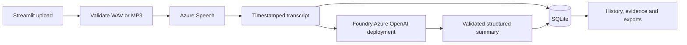

# Call Insights — Foundry Demo

A local Streamlit application for English and Hindi call recordings: Azure Speech transcription, evidence-linked summaries from an Azure OpenAI deployment in Foundry, and SQLite history.

**Implemented and tested offline. Live Azure integration and language accuracy are not yet verified.** Without credentials, you can explore clearly labeled handwritten sample previews. Hinglish and automatic language detection are deferred.

## Quickstart

Requires Python 3.12. From a checkout on Windows PowerShell:

```powershell
python -m venv .venv
.\.venv\Scripts\python.exe -m pip install -r requirements-dev.txt
.\.venv\Scripts\python.exe -m streamlit run app.py
```

On macOS/Linux use `.venv/bin/python` for the last two commands. Open [the local app](http://127.0.0.1:8501). The app binds to localhost and creates `data/calls.sqlite3` automatically. Sample preview requires no Azure account and makes no API requests; its transcript and summary are handwritten, not generated from uploaded audio.

For live processing, open **Azure settings** in the sidebar and enter the Speech endpoint/key, Azure OpenAI endpoint/key, and model deployment name. Select **Apply Azure settings**. Nonblank UI values take priority; blank fields fall back to environment variables or `.env` (see [Azure setup](docs/azure-setup.md)). Keys are masked, kept only in the current session, and never written to disk. **Clear session settings** removes UI overrides and restores fallback settings. A new browser session may require re-entry. Upload stays disabled until effective settings are valid; applying settings does not make a connection test or API call.

## Features

- WAV/MP3 upload with preview, actual media validation, 50 MB/10 minute limits, and duplicate warnings.
- Explicit English or Hindi recording language; English or Hindi summary output.
- Timestamped transcript segments with neutral speaker labels when supplied by Azure.
- Overview, purpose, key points, decisions, actions, unresolved questions and outcome; expandable source evidence for actions and decisions.
- SQLite history, Unicode TXT/Markdown/JSON exports, and confirmed deletion.
- Persisted processing stages, bounded transient retries and summary retry without retranscription.
- Temporary audio cleanup and safe error messages that omit provider response bodies and credentials.

## Validation

```powershell
.\.venv\Scripts\python.exe -m pytest -q
```

The suite uses temporary databases, generated test audio, mocked Azure HTTP responses, and Streamlit AppTest. It covers state transitions, competing processing claims, retries, Unicode exports, validation and UI behavior. It does **not** establish recognition accuracy, summary factuality, regional availability, or live cost/latency. See [validation status](docs/validation-report.md) and [pending language evaluation](docs/language-feasibility.md).

## Architecture



## Documents and tracking

- [Phased roadmap and ownership](docs/roadmap.md)
- [Architecture and data model](docs/architecture.md)
- [Implementation contracts](docs/implementation-contracts.md)
- [Azure configuration](docs/azure-setup.md)
- [Evaluation criteria](docs/evaluation.md) and [six synthetic recording scripts](docs/evaluation-fixtures.json)
- [Demo walkthrough](docs/demo-guide.md)
- [Independent code review](docs/code-review.md)
- [GitHub issues](https://github.com/anshika6252/call-insights-foundry-demo/issues) and [milestones](https://github.com/anshika6252/call-insights-foundry-demo/milestones)

## Limits and data handling

Run one Streamlit process per database. This is a local single-user demo, without authentication or production hosting. Use synthetic or consented recordings. Live processing sends audio and transcripts to configured Azure services. Audio files are temporary; SQLite retains transcript and summary text until deleted. Upload widgets can hold the current recording in session memory until removed or the browser session ends. History does not retain audio playback.

Two-speaker diarization is requested; labels do not identify people or assign customer/agent roles. English uses `en-IN` and Hindi `hi-IN`. Evidence validation checks that referenced segments exist; human review must establish factual support. Summary input is bounded by serialized character count, not an exact token budget. Oversized inputs are rejected rather than split or truncated.

Credentials, recordings, runtime databases and generated exports are ignored by Git. No Azure resources were provisioned. Live setup and quality gates remain open until configured resources and representative recordings are available.
