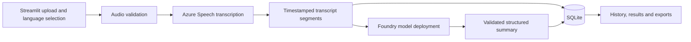

# Architecture and data model

## Implemented flow

Streamlit handles presentation. Python service modules handle validation, Azure adapters, processing coordination, summarization, and persistence. A separate API server is unnecessary for this demo. Keep Azure integrations behind small interfaces so evaluation can change the transcription configuration without changing the UI or database contracts.

## Language behavior

Input mode is English or Hindi, selected explicitly. Hinglish and automatic language detection are deferred. Store that choice separately from provider-detected locales. Preserve provider transcript text and timing; do not silently translate, transliterate, or rewrite the saved transcript. Live language quality remains unverified.

Summary language is English by default or Hindi by selection. Translate meaning while preserving names, numbers, dates, negation, commitments, and uncertainty. Treat spoken instructions as transcript content, never as instructions to the summarizer.

## Summary contract

- Overview, call purpose, key discussion points, decisions, unresolved questions, and outcome.
- Action items with description, optional explicit owner, optional explicit due date, and supporting segment IDs.
- Decisions include supporting segment IDs.
- Unknown facts remain null or explicitly unspecified; do not infer commitments from suggestions.
- Store schema version, prompt version, model deployment identifier, summary language, and creation time.
- Validate structure and segment references before marking a call complete. Schema validity alone does not establish factual accuracy.

## SQLite entities

| Entity | Fields |
| --- | --- |
| calls | ID, original filename, SHA-256 hash, input mode, detected locales, duration, size, created/updated timestamps, status, failed stage |
| transcript_segments | ID, call ID, sequence, optional speaker label, start/end milliseconds, original text, optional detected locale |
| summaries | ID, call ID, structured JSON, summary language, schema/prompt versions, deployment, timestamp |
| processing_runs | ID, call ID, stage, start/end timestamps, outcome, sanitized error, provider request ID when available, available usage metrics |

Foreign keys, transactions, indexed call references, and deterministic segment ordering are implemented. Schema version 1 uses SQLite user_version; newer unknown versions are rejected. Deleting a call removes dependent records, and active calls cannot be deleted. Run one Streamlit process per database; deployment or multiuser operation needs a separate design review.

## Lifecycle and recovery

`uploaded → transcribing → summarizing → completed`; failures record the stage and a sanitized reason. Persist the transcript before starting summarization. A failed summary can be retried without retranscribing. Since source audio is temporary, transcription retry after cleanup or restart requires re-upload. Interrupted runs are marked recoverable/failed on restart rather than appearing indefinitely active.

Streamlit reruns do not submit processing requests. Persisted state and an atomic stage claim guard duplicate work; matching hashes trigger an explicit reprocessing choice. Bounded retries apply only to transient failures. Cancellation control signals release the claimed stage and are re-raised to Streamlit. A crash between stages can leave an uploaded call with a saved transcript; history offers summary retry for this state too.

## Storage and privacy

Temporary audio uses generated paths and is cleaned on success, failure and cancellation. Startup removes generated audio older than 24 hours from the configured temporary directory. Current uploads can remain in Streamlit session memory until removed or the session ends. Credentials, audio and full transcripts are not logged. History retains text until deletion; runtime data is ignored by Git. Audio limits are checked before submission. Serialized transcript characters are bounded before summarization; this is not an exact token/context guarantee. Oversized text fails without truncation.
