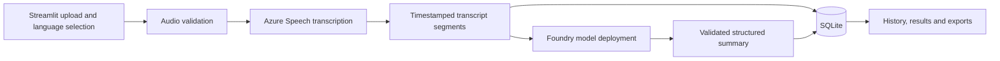

# Architecture and data model

## Proposed flow

Streamlit handles presentation. Python service modules handle validation, Azure adapters, processing coordination, summarization, and persistence. A separate API server is unnecessary for this demo. Keep Azure integrations behind small interfaces so evaluation can change the transcription configuration without changing the UI or database contracts.

## Language behavior

Input mode is Auto, English, Hindi, or Hinglish. Store that choice separately from provider-detected locales. Do not force a Hinglish recording through a monolingual setting without evaluation. Preserve provider transcript text and timing. Mixed-script display is a quality target, not a guaranteed API behavior. Do not silently translate, transliterate, or rewrite the saved transcript.

Summary language is English by default or Hindi by selection. Translate meaning while preserving names, numbers, dates, negation, commitments, and uncertainty. Treat spoken instructions as transcript content, never as instructions to the summarizer.

## Summary contract

- Overview, call purpose, key discussion points, decisions, unresolved questions, and outcome.
- Action items with description, optional explicit owner, optional explicit due date, and supporting segment IDs.
- Decisions include supporting segment IDs.
- Unknown facts remain null or explicitly unspecified; do not infer commitments from suggestions.
- Store schema version, prompt version, model deployment identifier, summary language, and creation time.
- Validate structure and segment references before marking a call complete. Schema validity alone does not establish factual accuracy.

## SQLite entities

| Entity | Planned fields |
| --- | --- |
| calls | ID, original filename, SHA-256 hash, input mode, detected locales, duration, size, created/updated timestamps, status, failed stage |
| transcript_segments | ID, call ID, sequence, optional speaker label, start/end milliseconds, original text, optional detected locale |
| summaries | ID, call ID, structured JSON, summary language, schema/prompt versions, deployment, timestamp |
| processing_runs | ID, call ID, stage, start/end timestamps, outcome, sanitized error, provider request ID when available, available usage metrics |

Use foreign keys, transactions, indexed call references, and deterministic segment ordering. Deleting a call removes dependent records. SQLite is suitable for this single-instance local demo; deployment or multiuser operation would need a separate design review.

## Lifecycle and recovery

`uploaded → transcribing → summarizing → completed`; failures record the stage and a sanitized reason. Persist the transcript before starting summarization. A failed summary can be retried without retranscribing. Since source audio is temporary, transcription retry after cleanup or restart requires re-upload. Interrupted runs are marked recoverable/failed on restart rather than appearing indefinitely active.

Streamlit reruns must not repeat paid requests. Use persisted processing state, explicit submit actions, and an in-flight guard. Warn on a matching file hash and allow deliberate reprocessing. Bounded retries apply to transient errors only; handle timeouts, throttling, invalid credentials, unsupported media, empty speech, and invalid model output distinctly.

## Storage and privacy

Temporary audio uses generated paths and is cleaned up on success and failure; stale files are cleaned after interruption. Do not log credentials, audio, or full transcripts. History retains text until the user deletes the call. Do not commit runtime data. Limit accepted input before service submission and enforce a transcript context budget; reject oversized text with a clear message rather than silently truncating it.
