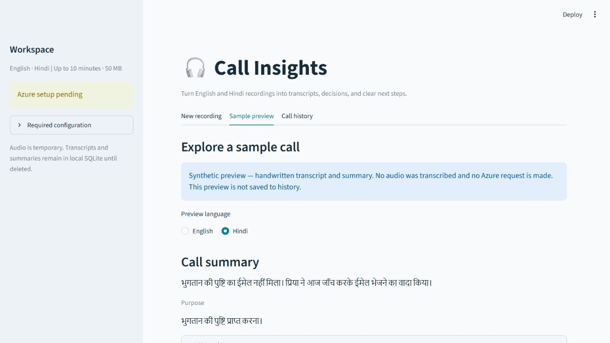

# Demo walkthrough

## Offline walkthrough — available now

1. Follow the README quickstart and open `http://127.0.0.1:8501`.
2. Explain the Azure setup pending message and disabled upload.
3. Open **Sample preview**. Its banner states that transcript and summary are handwritten, no audio was transcribed, and no Azure request is made.
4. Select English, then Hindi. Inspect the summary, owner, due date and unresolved outcome.
5. Expand **View evidence** for the cited text and timestamp, then the full transcript.
6. Download TXT, Markdown and JSON previews. Exports identify their synthetic source.
7. Open **Call history**; previews are deliberately not saved as processed calls.

Offline preview demonstrates the interface, not AI accuracy. Tests separately exercise persistence, recovery and deletion using temporary data and mocked providers.

## Live walkthrough — pending Azure

1. Configure `.env` using [Azure setup](azure-setup.md), restart, and confirm configuration is present.
2. Select the actual English/Hindi recording language and desired summary language separately.
3. Upload a consented or synthetic WAV/MP3 up to 50 MB and 10 minutes. Preview it and select **Transcribe and summarize**.
4. Inspect stage progress, saved transcript, neutral speaker labels, summary and evidence.
5. Open history, restart, reopen the same call, and download its exports.
6. Duplicate uploads require explicit reprocessing. Prefer opening the original when repetition is unnecessary.
7. For failed summaries, **Retry summary** uses the saved transcript. For failed transcription after cleanup, re-upload the audio.
8. Confirm deletion only when intending to remove the selected call and all results. There is no restore UI.

Repeat with three recordings per language and both summary languages for the pending evaluation. Hinglish is outside this version.

## Troubleshooting

| Symptom | Action |
| --- | --- |
| Upload disabled | Expand Required configuration, set named variables, restart |
| Invalid endpoint | Use HTTPS resource root without path/query |
| HTTP 401/403 | Check endpoint, key, resource access and deployment match |
| HTTP 429/503 | Check quota/availability; retries are bounded |
| Empty/malformed transcript | Check audio, language, regional and API support |
| Summary input exceeds budget | Use shorter audio; verify context before increasing character limit |
| Interrupted run | Retry saved summary or re-upload audio as appropriate |
| Local storage error | Check folder permissions and stop duplicate processes using the database |

## Cleanup and limitations

Stop the server with Ctrl+C. Remove uploaded audio from the widget to release its session copy. Generated files are removed after processing; startup removes stale generated audio older than 24 hours in the configured directory. Call deletion removes its SQLite records. Close the app before manually removing the database for a fresh history.

No Azure resources were created. If dedicated demo resources are later created, record their names and remove only those resources after use; preserve shared resources. Verify consequential facts against the recording. Model output and evidence references can still be wrong.
